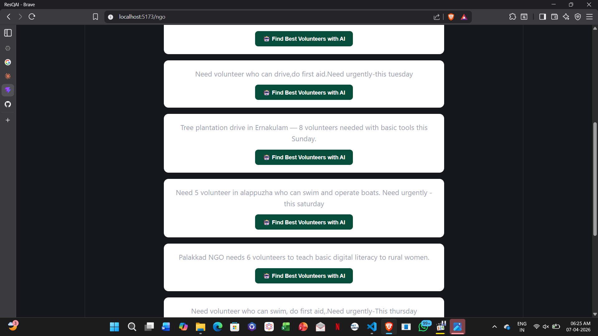
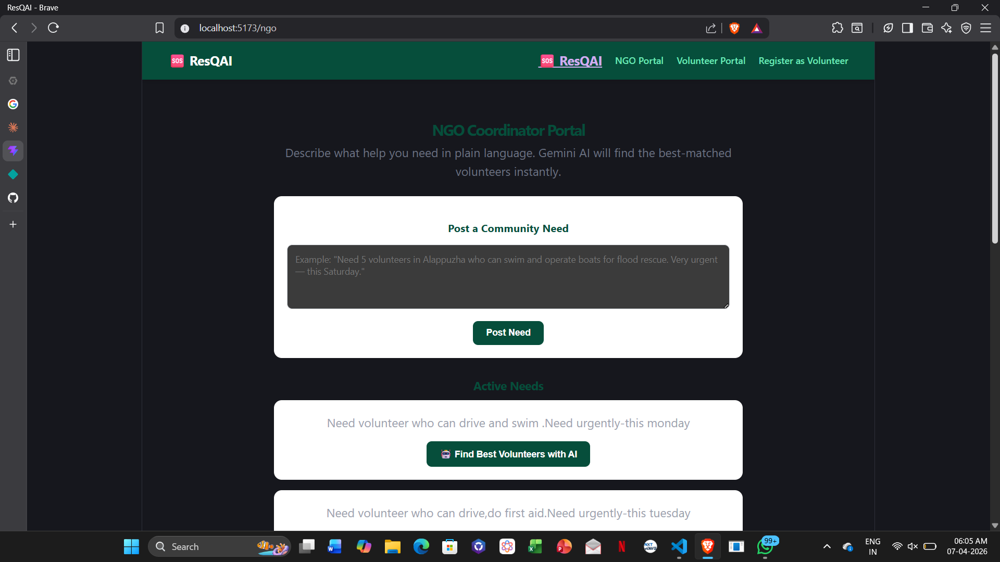
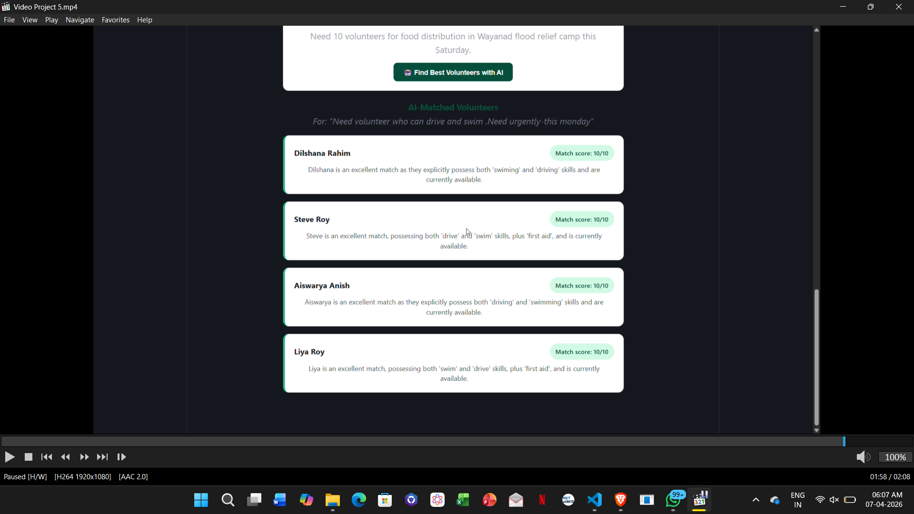
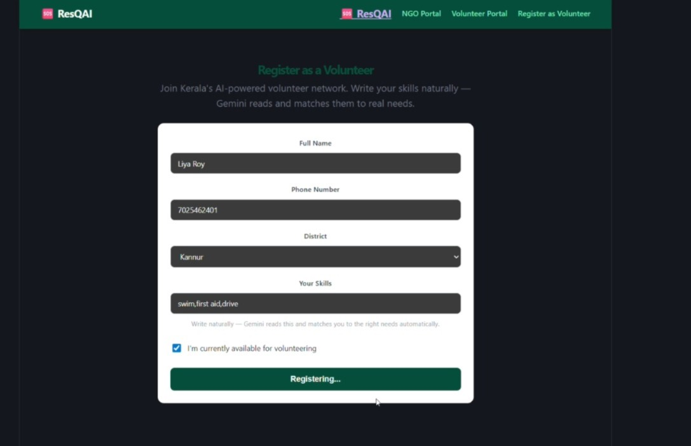

# ResQ AI 🌿

## Problem Statement

Kerala has an incredibly active volunteer culture — floods, health camps, food drives, disaster relief. But every time a crisis hits, NGO coordinators scramble through hundreds of WhatsApp messages trying to find the right people. They send engineers to cook food and teachers to flood zones, while trained swimmers sit at home two kilometres away, not knowing they're needed. There is no structured, intelligent system connecting the right volunteer to the right need at the right time.

## Project Description

ResQ AI is an intelligent volunteer coordination assistant for NGOs in Kerala. A coordinator simply types what help they need in plain language — the way they'd text a friend. Gemini 2.0 Flash reads the request, understands the required skills, location urgency, and safety factors, then instantly ranks the best-matched volunteers from a registered pool with a clear reason for each match — all in under 10 seconds. Volunteers register once with their skills and district, and the AI does the matching automatically from that point on.

## Google AI Usage

### Tools / Models Used

- Gemini 2.0 Flash API

### How Google AI Was Used

Gemini 2.0 Flash is the core intelligence of ResQ AI. When an NGO coordinator posts a need in natural language, the full description is sent to Gemini along with the registered volunteer pool. Gemini analyzes the request contextually — identifying required skills, evaluating location proximity, applying safety filters (for example, only matching people with medical backgrounds to healthcare needs), and ranking the top five volunteers with a human-readable explanation for each match. This is not keyword filtering — it is genuine natural language understanding applied to a real coordination problem.

## Proof of Google AI Usage

Screenshots of Gemini API responses and Cloud Console logs are in the `/proof` folder.



## Screenshots





## Demo Video

Upload your demo video to Google Drive and paste the shareable link here (max 3 minutes). [Watch Demo](https://drive.google.com/file/d/1cJw79j9xMCYaF5IvnBYZ6-VO3AsGKERm/view?usp=drivesdk)
## Installation Steps
```bash
# Clone the repository
git clone https://github.com/liya-royy/ResQAI

# Go to backend folder
cd ResQAI/backend

# Install dependencies
pip install -r requirements.txt

# Start the backend server
python app.py

# In a new terminal, go to frontend
cd ResQAI/frontend

# Install and run
npm install
npm run dev
```

## Live Links

- Backend: [Cloud Run URL]
- Frontend: [Firebase URL]

## Team

- Liya — Backend, Gemini AI integration, Cloud deployment
- Dilshan — Firebase, testing, documentation  
- Aishwarya — Frontend, UI/UX, presentation
